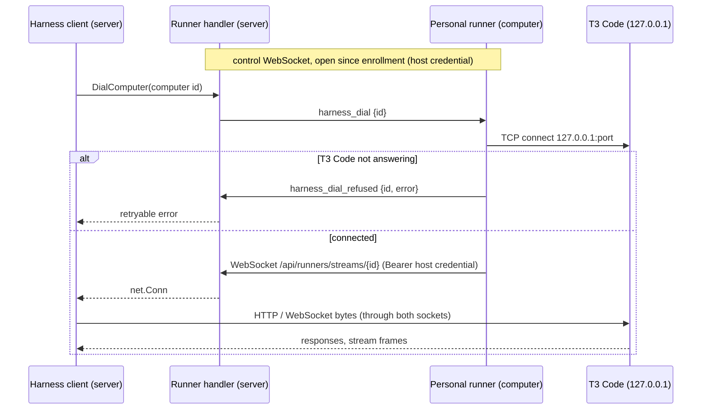

# Personal runners: one command adds a computer

**Status:** ready-for-agent

## Problem

Pairing a computer today takes three steps and a Cloudflare account:

1. **Tunnel.** The person names the computer, Nexul creates a Cloudflare tunnel, DNS record and Access app
   in the instance's own account (ADR 0062), and the person runs `tunnel.sh`/`tunnel.ps1`, which installs
   `cloudflared` as a system service and, since ADR 0142, T3 Code when it is missing.
2. **Pair T3 Code.** The person makes a one-time pairing link in T3 Code (`t3 pair`, or the desktop app's
   Authorized clients) and pastes it into Nexul.
3. **Set up.** Setup turns connect each provider to Nexul's MCP and install the skills (ADR 0063).

The tunnel is what forces Cloudflare plus Zero Trust on every instance, which is why setup started pushing
Cloudflare as near-required. Step 2 is a paste every 30 days, because T3 Code's bearer session cannot be
refreshed (`internal/t3rpc/pair.go:61`). Pair by URL, the alternative, asks the person to open T3 Code's
port on every interface (`T3CODE_HOST=0.0.0.0`), which the guide has to warn about.

Nexul already has a program that holds an authenticated outbound connection from a machine to the server:
the runner (`internal/runner/client.go:113`, ADR 0031, ADR 0074). This effort puts a runner on the person's
own computer and reaches T3 Code through it.

## The flow

```
Add a computer (one command, enrolls a personal runner for this person)
└─ the installer checks: T3 Code?
   ├─ No  → install it (T3 Code's own installer and background service; the desktop app via winget on Windows)
   └─ Yes → reuse it
   the runner starts, connects, and reports facts
   └─ Nexul pairs over the runner's connection (the runner mints the one-time token locally)
      └─ Set up (unchanged, ADR 0063)
   keep watching: re-pair before the 30-day session ends, restart a stopped T3 Code service, report facts
```

The person sees one dialog: **Add a computer**, a command to copy, then three live checks (the computer
connected, T3 Code found, paired), then the existing Set up step.

## Decisions

Owner's calls (2026-10-10):

1. **No Cloudflare tunnel for computer pairing.** Nexul reaches T3 Code on the computer's loopback address
   through the personal runner's connection. Tunnels stay for domains, exposures and the setup wizard's
   tunnel path.
2. **The personal runner is the only way to pair a computer.** No manual fallback: the tunnel flow, the
   pasted pairing link and Pair by URL all go. A VPS or a computer on the LAN gets a personal runner too.
3. **Existing computers keep working until their owner installs a runner,** which adopts the same computer
   record. Then the old tunnel is retired, and once the old computers have moved, a last slice deletes the
   tunnel pairing code, UI, scripts, docs and the "Computer tunnel" term. They keep working for at least 30
   days after runners ship (decision 20).
4. **Cloudflare becomes optional.** Setup and onboarding offer it for what it is still for (the instance's
   own domain through a tunnel, exposures, DNS) and stop presenting it as needed for agents.

Technical decisions made for this spec:

5. **One runner binary, two modes.** `nexul-runner` gains a personal mode (`NEXUL_RUNNER_MODE=personal`).
   A personal runner belongs to one person and one computer, needs no Docker, runs as that person's OS user,
   and only does that person's harness work. A runner that is not personal keeps today's behaviour.
6. **The relay is a WebSocket per relayed connection, opened by the runner.** No multiplexer, no new
   dependency. Details under Architecture.
7. **The runner, not the server, picks what it dials:** always the loopback address and the T3 Code port it
   found itself. No frame carries a host or a port.
8. **Pairing reuses `harness.Client.Pair` unchanged.** The runner mints a one-time token with
   `t3 auth pairing create --json --ttl 5m --label Nexul` and sends it on its own connection; the server
   exchanges it through the relay exactly as it does today (`internal/t3rpc/pair.go:32`), so kind detection
   and the forward-only protocol switch (ADR 0113) need no change.
9. **Re-pairing is automatic.** When a computer's session ends within 7 days and its runner is connected,
   the server asks for a fresh token and pairs again. It is checked when the runner connects and on each
   facts report (every 6 hours), so no server-side loop polls.
10. **The computer row is created by Add a computer, before the install.** It waits for its runner the way
    a tunnel computer waits for its tunnel today (`internal/pairing/tunnel_usecase.go:39`). Its name
    defaults to the hostname the runner reports and can be renamed.
11. **One pointer between the domains:** the runner row records its owner and its computer. The pairing
    domain reads it through a narrow seam; it never writes runner rows, and the runner domain never writes
    computer rows.
12. **Facts are a JSON snapshot on the computer row.** They are read whole and never queried by field.
13. **T3 Code is installed by `nexul install computer`, at install time, in the terminal.** The long-running
    runner never installs software on its own. It restarts a T3 Code background service that stopped
    answering, and otherwise only reports.
14. **No permission bit to add a computer.** Anyone signed in may add a computer for themselves, a Restricted member
    included, as pairing allows today. Personal runners never appear in the runner or machine lists that
    `runners:read` and `machines:read` open.
15. **The harness work is typed frames, not shell jobs.** Pairing, re-pairing, facts and restarting T3 Code
    are fixed actions with structured results. They must keep working on a runner whose shell jobs are off,
    and a pairing token is a value to hand back, not output to parse. They share the process and output
    plumbing with shell jobs, not the protocol.
16. **Shell jobs and container logs come after pairing works** (owner, 2026-10-10), as their own slices. See
    "Later: shell jobs" and "Later: container logs on a computer".
17. **One person, several computers.** Each personal runner is one computer record: Alice's PC and Alice's
    laptop are two computers with a runner each. Her computer list, her default computer and her per-project
    choice of where to run (computer and T3 project, her project link, which the play dialog's first-run
    "where to run" prompt saves) pick between them. Facts, setup, grants and command history are per
    computer, so Alice can share her laptop with Bob and not her PC. "Computer" is the word for a person's
    own; "machine" stays the server that deploy runners run on (CONTEXT, Machine).
18. **An offline computer is never swapped for another.** A computer whose runner is not connected, or
    whose T3 Code is not answering, shows as offline, and a run aimed at it, by a project link, the
    defaults or the run dialog, fails at once saying "<computer> is offline" with the reason, rather than
    running on another of the person's computers. Auto plays already wait for the computer to come online
    (CONTEXT, Auto play); that stays.
19. **One process, isolated lanes.** The runner relays T3 Code and also runs jobs, shell jobs, container
    logs and, on deploy runners, deploys. Each is a lane that cannot stall or kill another (see "Lanes"
    under Architecture).

Owner's answers to the open questions (2026-10-10, second round):

20. **Tunnel-paired computers keep working for at least 30 days after runners ship.** The removal slice
    (ticket 14) deletes tunnel pairing only once no tunnel or URL computer remains, or every remaining owner
    has had the in-app notice for 30 days. Their rows, links and setup are kept either way (Moving existing
    computers).
21. **The runner never updates T3 Code,** neither automatically nor from a button. The desktop app updates
    itself; a command-line install is the person's to update. The runner reports the version it finds.
22. **The install line is `curl -fsSL <site>/computer.sh | sudo sh -s -- <token>`.** It installs for
    `$SUDO_USER`, the person who typed `sudo`, never for root. A direct root login with no `SUDO_USER` is
    refused, and a machine without sudo gets a clear message. Because sudo is always there, Linux installs a
    **system** service, `/etc/systemd/system/nexul-computer.service` with `User=<that user>`: it starts at
    boot and survives logout with no lingering. macOS installs a LaunchDaemon with `UserName` set to that
    user, and Windows a service under that user's account or the closest equivalent (Installing a personal
    runner). The runner process itself never runs as root.
23. **The app says Computers.** The settings page titled "T3 Code Setup" is renamed **Computers**. "Personal
    runner" stays internal, in code and `CONTEXT.md`.
24. **Commands on a computer are on the record, and a new permission reads them.** The audit log records
    which computer and the command for actions on a computer. A new instance-wide permission, **Read
    computer activity**, grants reading that; the Owner role has it by default. Each computer's page tells
    its owner: "Commands run here are recorded and can be read by people with Read computer activity." This
    is the one deliberate exception to "nobody else sees another person's computer" (Access and privacy,
    rule 5).
25. **Retention.** A shell job's command line, who ran it, when and its exit code are kept forever. Its
    output is deleted after 30 days; until then the computer's owner and holders of Read computer activity
    can read it.
26. **Sharing ships with both levels, "Run commands" and "Run agents".** "Run agents" runs with the
    starter's own Nexul identity: each run carries a short-lived token for the person who started it, so
    Bob's agent sees only what Bob can see in Nexul, never Alice's login. Every place the run appears shows
    "Run by Bob using Alice's <computer name>" (Later: sharing a computer).
27. **Shell commands are on by default for the computer's owner,** the person who installed the runner, not
    the instance's owner, with a per-computer off switch. Sharing is off until the owner grants it.
28. **Facts** are the computer's OS and architecture, the versions of T3 Code, `cloudflared` and the
    providers, which providers are signed in, T3 Code's projects and their folders, the git name and email,
    and free disk. They are visible only to the owner and to agents acting for them. Read computer activity
    does not reach them.
29. **Platform order:** Linux, then macOS, then Windows.

## Architecture

### What the server calls on T3 Code today

Everything goes through one `http.Client` built in `server/cmd/services.go:221`, wrapped in
`cloudflare.AccessTransport` for tunnel hostnames, and handed to both T3 clients through `t3rpc.Options`:

- `GET /.well-known/t3/environment`, unauthenticated, before pairing and as the version probe
  (`internal/t3rpc/pair.go:73`).
- `POST /oauth/token`, the token exchange (`internal/t3rpc/pair.go:32`).
- `POST /api/auth/websocket-ticket`, then a long-lived WebSocket `GET /ws?wsTicket=…`
  (`internal/t3rpc/conn.go:141`), the Effect RPC session. It carries every RPC and stream, with a ping every
  30 seconds (`conn.go:35`). The presence keeper holds one per computer while its owner has Nexul open
  (`internal/presence/keeper.go:253`); each turn, setup turn and catch-up holds another.

So the relay must carry plain HTTP request and response and several concurrent long-lived WebSockets per
computer. All of it is HTTP/1.1 over TCP to one local port.

### The relay

The harness HTTP client gets a `DialContext` that recognises a computer reached through its runner and,
instead of a TCP dial, asks the runner domain for a `net.Conn`:

1. A computer with a runner gets the session address `http://<computer id>.nexul-computer.invalid`
   (`.invalid` never resolves, RFC 6761). `pairing.Computer.Session()` builds it; the stored and shown
   address stays `http://127.0.0.1:<port>`. The transport sets the request's `Host` to that loopback
   address, so T3 Code sees what a local client sends.
2. `runner.Handler.DialComputer(ctx, computerID)` finds the connected personal runner for the computer,
   mints a single-use stream id, registers a waiter, and sends `harness_dial {id}` on the runner's control
   connection.
3. The runner dials `127.0.0.1:<its T3 Code port>` (or `[::1]` when T3 Code bound only that). If that fails
   it answers `harness_dial_refused {id, error}`. If it succeeds it opens a second WebSocket to
   `/api/runners/streams/{id}` with its host credential.
4. The server accepts that socket only if the id is pending, under 10 seconds old, and was issued to this
   same runner. Both ends wrap their socket in `websocket.NetConn(…, MessageBinary)` (coder/websocket,
   already the WebSocket library, `go.mod`; its `NetConn` lifts the read limit) and copy bytes until either
   side closes.
5. The dial returns the `net.Conn`. `http.Transport` pools it like any keep-alive connection, and the T3
   WebSocket dial (`t3rpc.Connect`) rides it unchanged.

Why one socket per connection rather than streams multiplexed over the control connection:

- TCP gives each relayed connection its own flow control end to end. A large turn transcript never delays
  another stream, and never delays the control connection's heartbeats. The control connection's 64 KiB
  read limit and three-missed-beats watchdog (`internal/runner/handler.go:59,63`) stay as they are.
- Multiplexing needs a framing and windowing layer: either a new dependency (a stream multiplexer is not in
  `go.mod`; the nearest, `golang.org/x/net`, is only indirect) or flow-control code of our own.
- A control connection that reconnects does not cut open relays, so a blip doesn't drop a running turn.

The cost is one WebSocket handshake per new connection, about one round trip to the instance. HTTP
keep-alive and the long-lived T3 WebSocket make that rare. This needs **no new dependency**.



Pairing over the relay:

```mermaid
sequenceDiagram
    participant S as Pairing use-case (server)
    participant R as Runner handler (server)
    participant P as Personal runner
    participant T as T3 Code
    P->>R: facts {t3: answering, port, version}
    R-->>S: runner.facts_reported (bus, members-only)
    S->>S: unpaired, or session ends within 7 days?
    S->>R: MintPairingToken(computer id)
    R->>P: t3_pair_token_request {id}
    P->>P: t3 auth pairing create --json --ttl 5m --label Nexul
    P->>R: t3_pair_token {id, token}
    R-->>S: token
    S->>T: Describe + POST /oauth/token through the relay (harness.Client.Pair)
    S->>S: save bearer (encrypted), kind, version; computer.paired
```

### The runner protocol

New frames in `internal/runner/protocol.go`, each with a validator like the rest:

| Frame | Direction | Carries |
|---|---|---|
| `harness_dial` | server → runner | `id` |
| `harness_dial_refused` | runner → server | `id`, `error` |
| `t3_pair_token_request` | server → runner | `id` |
| `t3_pair_token` | runner → server | `id`, `token` or `error` |
| `facts` | runner → server | the facts report (below) |

Request and response pairs correlate by id, the way `discover`/`discover_result` already do
(`handler.go:78`). A personal runner refuses `assign_build`, `assign_deploy`, `assign_upgrade` and
`join_networks` with a warning (and `discover` and `logs_request` until container logs land, ticket 17), and
the server never sends them: `fits`
(`internal/runner/events.go:140`) today lets a job with no target machine run on any runner, so it must
exclude personal runners, and so must `connOnMachine` and `connNamed`. `update` and `uninstall` work for
both modes, so personal runners update themselves (ADR 0052) and remove themselves (ADR 0074) for free.

The stream endpoint caps open streams per runner (32) on both ends, and the server closes a runner's streams
when its credential is revoked.

### Lanes

The runner is one process with separate lanes, so heavy work in one never starves another:

- **Separate sockets.** The control connection carries only small frames: heartbeats, requests, results,
  facts, job and log output. T3 Code's bytes never ride it: each relayed connection is its own WebSocket,
  under the same runner credential (The relay, step 3). A build log or a log tail at its 64 KB a second cap
  cannot delay a T3 Code stream, and a large T3 Code transfer cannot delay a heartbeat.
- **Flow control per stream.** Each relayed connection is its own TCP connection end to end, so one T3
  Code stream that stops reading backs up only itself; there is no shared buffer for it to fill.
- **A dumb pipe.** The relay copies bytes between the stream socket and loopback on the T3 Code port. It
  never parses, rewrites or stores them, and never dials anything else.
- **Contained failures.** Every goroutine the runner starts for a frame (a relayed stream, a job, a shell
  job, a log stream, a T3 Code action) runs under a recover that logs the panic, ends only that unit with
  an error frame or a closed stream, and leaves the rest running. What a recover cannot catch (a fatal
  runtime error, running out of memory) ends the process, and the service manager starts it again
  (`Restart=always` on the systemd service, `KeepAlive` on the LaunchDaemon, restart on failure on the
  Windows service or task).
- **Caps per lane.** 32 relayed streams, 16 log streams (ADR 0091), 4 shell jobs with the rest queued,
  each with its own output rate and size limits. No lane borrows another's budget.
- **Restarts and updates.** A self-update (ADR 0052) or a restart drops open relayed streams for a few
  seconds. The server side already recovers from that: the presence keeper redials with backoff
  (`internal/presence/keeper.go:20`), a running turn's dropped harness connection is redialed and the turn
  resumed where it left off (CONTEXT, Trail), and a turn that finds T3 Code updated meanwhile ends with
  ADR 0113's message. This is the same path that follows running trails again after a server restart
  (ADR 0119). A personal runner defers its update until no shell job runs, as ADR 0052 defers it past a
  deploy job, but never waits on relayed streams, which are always open while their owner has Nexul
  open.
- **Health per lane in the UI.** The computer row shows each lane on its own: the runner connected,
  T3 Code answering through it, and, once they exist, shell jobs (on, off, or refused at the computer) and
  Docker (available or not). A computer whose runner is up but whose T3 Code is down says exactly that.

### Finding T3 Code on the computer

The runner, as the person's OS user:

- finds the command: `t3` on `PATH`, else `$T3CODE_HOME/bin/t3` (default `~/.t3/bin/t3`, the desktop app's
  launcher; `t3.cmd` on Windows), else `~/.local/bin/t3` (the command-line install), the same order as
  `website/public/tunnel.sh:72`;
- finds the port from `$T3CODE_HOME/userdata/server-runtime.json` (default `~/.t3`; `port`, `host`, `pid`,
  `serviceManaged`; T3 Code's `apps/server/src/serverRuntimeState.ts:11`). Only the default home falls back
  to 3773 when the file is missing. With any other `T3CODE_HOME` and no file, the runner refuses the dial
  ("T3 Code isn't running in <home>"), because T3 Code deletes the file when it stops and 3773 may be
  another T3 Code, such as a developer's own beside a throwaway one;
- confirms it with `GET http://127.0.0.1:<port>/.well-known/t3/environment`;
- reports one of `answering`, `not_running` (installed, nothing answers), `missing`, or `not_loopback`
  (T3 Code bound to an address that is not loopback or a wildcard, which the runner refuses to reach).

Minting uses `t3 auth pairing create --json`, which writes to T3 Code's own database without the server's
HTTP API (`apps/server/src/cli/auth.ts:85`), so it works for the desktop app too. The one-time token
exchange is accepted even under the desktop app's `desktop-managed-local` policy; the policy's
`bootstrapMethods` is advisory (`apps/server/src/auth/EnvironmentAuthPolicy.ts:32`; the exchange checks only
the grant's own method, `EnvironmentAuth.ts:1266`).

Keeping it running: every 30 seconds the runner probes the port. A T3 Code its background service runs
(`serviceManaged`, or `t3 service status`) that misses two probes is restarted with `t3 service restart`, at
most once per 5 minutes. A desktop app that is closed is reported as `not_running`, and the row says
"Open T3 Code".

### Facts

What only the computer knows comes from the runner; what T3 Code knows comes from the harness through the
relay, as the settings pages already read it:

- From the runner: OS, architecture, hostname, the runner's version, T3 Code's state, install kind
  (`service`, `command line`, `desktop app`), version and port, the version of `cloudflared` when it is
  installed, git's global `user.name` and `user.email`, and free disk space in the home folder.
- From T3 Code, read by the server after each pairing and each facts report: providers with their versions
  and models and whether each is signed in (`ListProviders`), and projects with their folders
  (`ListProjects`).

Facts are the owner's alone. The owner reads them on the computer's row, and an agent acting for the owner
reads them through `computer_list`. No grantee, no workspace Owner and no holder of Read computer activity
does (Access and privacy).

The runner domain hands a report to the pairing domain as `runner.facts_reported` on the bus (ephemeral,
never bridged to a socket). Pairing stores it as one JSON column with its time on the computer row, shows it
in the row's details, returns it from `computer_list`, and on a change publishes `computer.facts_changed`
(outbox), followed live by the web's pairing domain. A personal runner's connect and disconnect publish
`runner.personal_changed` (ephemeral, like `computer.setup_turn_activity`) carrying the computer and owner
ids, instead of `runner.connected`/`runner.disconnected`. Every one of these is members-only and reaches
only its owner's sockets (Access and privacy, rule 2).

### Installing a personal runner

The person runs one line, `curl -fsSL <site>/computer.sh | sudo sh -s -- <token>` (`computer.ps1` on Windows,
ticket 09); nobody types `nexul`. `<site>` is `https://nexul.io` unless the instance sets another. The token is an
HS256 JWT the instance signs with a key derived from its existing auth secret (no new secret, no new env var). Its
claims carry the instance's address, the single-use enrollment code, the computer's id and `exp`, the code's
one-hour expiry. `computer.sh` checks the OS (Linux now; macOS and Windows say "coming soon" until tickets 08 and
09), decodes the token's middle segment in POSIX sh (base64url to base64, re-pad, `base64 -d`, a `sed` for
`server`; no `jq`) only to say where it connects, and hands over to `install.sh`, which downloads and checksums
the `nexul` command into the user's own `~/.local/bin` and runs `nexul install computer --token <token>`. That
engine sends the whole token to the instance it names, which checks the signature, the expiry and that the code is
unused before enrolling.

The script cannot check the signature, and needs not: the key never leaves the instance, a token whose payload was
altered (a swapped server, another computer) fails at the instance that signed it, and any other instance has a
different key. The code inside is single use and dies within the hour, so a token seen in shell history or a chat
is worth nothing once used. An instance tested against its own build renders the command with its script site
and release (`NEXUL_SITE_URL`, `NEXUL_RELEASE_URL` on the server), carried as `NEXUL_INSTALL_URL` and
`NEXUL_RELEASE_URL` for the scripts, as `runner.sh` honours them.

**Who it installs for.** `sudo` runs the installer as root, only to place a system service; the runner it installs
never runs as root.

- It installs for `$SUDO_USER`, the person who typed `sudo`. Run as root with no `SUDO_USER` (a direct root login),
  or with `SUDO_USER=root`, it refuses and says to run the command from your own account with `sudo`; nothing is
  installed.
- Run without root, it says to put `sudo` in front of `sh`. On a machine with no `sudo`, the piped command itself
  fails with the shell's own "command not found", so the script, run without root, checks `command -v sudo` and
  says that this computer has no sudo: install it and add your account to the sudo group, then run the command
  again. The guide says the same.
- Everything under the user's home (the `nexul` command, the data folder with the host credential at mode 0600) is
  owned by that user; only the service definition belongs to root.

| OS | Where | Service | Notes |
|---|---|---|---|
| Linux | `~/.local/bin/nexul`, data under `~/.local/share/nexul`, both the user's | systemd **system** service `/etc/systemd/system/nexul-computer.service` with `User=<that user>`, `Restart=always`, enabled and started | Starts at boot and survives logout. No lingering and no user manager are involved for the runner. |
| macOS | `~/Library/Application Support/nexul` (today's macOS root) | LaunchDaemon with `UserName` set to that user, `KeepAlive` | Ticket 08. The existing macOS path, as a daemon, skipping Docker. |
| Windows | `%LOCALAPPDATA%\Nexul` | A service under that user's account, or the closest equivalent | Ticket 09. A service under a named account needs that person's password or the log-on-as-service right; the fallback is the per-user Scheduled Task at log on with restart on failure. T3 Code on Windows is the desktop app, which runs only while the person is logged in anyway. Ticket 09 decides. |

Today's code is ahead of this table: ticket 02 shipped a systemd **user** unit with lingering, which refuses root.
Ticket 20 changes it to the Linux row, and removes the lingering step.

The `computer` kind skips Docker. It then makes sure T3 Code is there (the logic `tunnel.sh` has today, moved into
Go so the three OSes share it), running T3 Code's own installer as the user, not root, and starts the service. T3
Code's own background service is a user service on Linux, so now that the installer has root it also turns on
lingering for that user (`loginctl enable-linger`), so T3 Code survives logout too (ticket 07 confirms how T3
Code installs its service). It prints what it installs and never prompts, as ADR 0142 requires of a piped script.

The service is `nexul-computer`, one per machine for now (the unit's name is fixed). A revoked runner has to remove
itself too (`internal/runner/client.go:300`, ADR 0074), but a process running as the person cannot delete a
root-owned unit, and no sudo rule is installed (owner, 2026-10-10). So the install also leaves a root cleanup: a
root-owned copy of `nexul` (`/usr/local/libexec/nexul-computer-uninstall`), a folder only the person may write in
(`/var/lib/nexul-computer`), and a systemd path unit, `nexul-computer-cleanup.path`, that starts the oneshot
`nexul-computer-cleanup.service` once `remove-requested` exists there. The service runs the copy's one fixed removal
for the person named in its unit: it reads neither the request's contents nor anything in the person's home, removes
the person's files as the person, and is idempotent. `nexul uninstall computer --detach`, which a removed runner
already runs, and `nexul uninstall computer` run as the person only write that request; under `sudo` the command
removes everything at once.

## Data model

Forward-only migrations; production has real data. Numbers are the next free ones on `master` when each
ticket lands.

- `runners`: add `owner_user_id TEXT NOT NULL DEFAULT ''` and `computer_id TEXT NOT NULL DEFAULT ''`.
  Empty means a runner that is not personal, so every existing row is correct with no backfill. A partial
  index on `computer_id WHERE computer_id != ''` serves `DialComputer`'s lookup and the pairing seam.
- `runner_enrollment_codes`: add `owner_user_id` and `computer_id`, the same defaults. A personal code is bound
  to its person and computer and enrolls nothing else. The `computer_id` index on `runners` is unique, so a
  computer has one runner even when two codes were minted for it.
- `pairing_computers`: add `facts TEXT NOT NULL DEFAULT '{}'` and `facts_at INTEGER`. No backfill: facts
  arrive with the runner.
- The tunnel columns (`migrations/0008_computer_tunnel.sql`) stay until the removal slice, which clears
  them once their Cloudflare resources are deleted. They are never dropped: an unused column costs nothing,
  and a drop is one more migration to get wrong on live data.

Personal runner names are generated (`computer-<8 random>`) because runner names are unique per instance
(`internal/runner/enrollment.go:63`) and nobody sees them. No machine row is made for a personal runner;
`machineFor` (`enrollment.go:128`) is skipped.

## Security model

- **The runner reaches only its own T3 Code.** It dials loopback only, on the port it found itself; the
  server never names a host or port. A compromised instance cannot use a laptop's runner to reach anything
  else on the person's network.
- **The pairing path runs no command the server sends.** Its T3 Code actions are a fixed list (mint a
  pairing token, restart the service), and a personal runner refuses every build, deploy and upgrade frame.
  Shell jobs, which do run what they are sent, are a separate capability: on for the computer's owner, off for
  everyone else until granted, and recorded (see "Later: shell jobs").
- **The install's root step is narrow.** It places the service and one root cleanup that can only remove the install (Installing
  a personal runner); the runner process, T3 Code and every file in the person's home stay the person's.
- **Streams are bound to their runner.** A stream id is single-use, lives 10 seconds, and is accepted only
  from the runner it was issued to, over that runner's host credential.
- **T3 Code stays on loopback.** Nothing asks the person to set `T3CODE_HOST=0.0.0.0` any more.
- **Credentials.** The host credential lives in the person's own data folder (`~/.local/share/nexul`), owned by
  them, mode 0600 (ADR 0074). The
  one-time pairing token lives 5 minutes and travels only on the authenticated control connection. The
  bearer session stays encrypted at rest on the server, as today. Logs never carry a token.
- **What the server trusts from the computer** does not change: T3 Code's answers were already untrusted
  input through the tunnel, and every read stays bounded (`maxResponseBytes`, `maxFrameBytes`).
- **Who uses the computer:** a computer has one owner, the runner's owner must be that owner (checked
  when the code is minted), and only the owner's turns resolve to it (ADR 0102) until the owner shares it
  (Later: sharing a computer). Access and privacy, below, makes this a set of hard rules.

## Access and privacy (hard rules)

Owner's rules (2026-10-10). Each is enforced in the use-case and the SQL that reads the rows (access in the
query, as ADR 0140 does for lists), never only in the UI, and each has a named test in the ticket that
builds it.

1. **Only its owner uses a personal runner and its computer**, plus that owner's own `@Agent` turns and
   play runs, and the people the owner shares it with (Sharing, below). Not a workspace Owner, not the
   instance's owner, not anyone holding every permission bit. Reading what ran on it is the one exception
   (rule 5), and it is reading only.
2. **Nobody else can see one.** Another person's computers and personal runners are not listed, have no
   facts, no status, no command history and no shell output for anyone else, on every path:
   - HTTP and MCP: every computer query is keyed by the caller (`user_id = ?`, or a live grant, below).
     Another person's computer id answers 404, never 403, so its existence is not confirmed.
   - Runner lists: `GET /api/runners`, the machine list, the import wizard and dispatch read
     `WHERE owner_user_id = ''`, so `runners:read` and `machines:read` show nobody's computer.
   - Events: a personal runner never publishes `runner.connected` or `runner.disconnected` (whose live
     audience is every `runners:read` holder, `server/cmd/live_audience.go:166`); it publishes
     `runner.personal_changed` instead. Every `computer.*` topic, the existing ones included, gains
     `members_only: true`, so `eventbus.MembersOnly` keeps it from integrations and automations
     (`internal/integrations/webhook.go:42`, `internal/automations/dialin.go:356`), as private channels'
     events are.
   - Live push: every `computer.*` topic and `runner.personal_changed` uses the `ownFrame` audience
     (`live_audience.go:64`); a grant's topic reaches exactly its owner and its grantee; shell job topics
     reach the computer's owner and the job's requester. `runner.facts_reported` is never bridged.
   - Audit log: rows hold only the method and path, never a body (`internal/integrations/audit.go:65`). The
     rows for actions on a computer are the exception to that and to the log's audience: they name the
     computer and, for a shell job, the command (rule 5), and `audit:read` alone returns none of them, in the
     query. Only Read computer activity does.
   - Facts are the owner's alone: not a grantee, not a holder of Read computer activity, not a workspace
     Owner.
3. **The checks are ownership, never permission.** They do not go through the permission gate, so no role,
   permission overwrite or the Owner's bypass (ADR 0042) can reach a person's computer.
4. **The one admin lever** is the account. Disabling or removing an account calls
   `RevokePersonalRunners(userID)` on the runner domain, which tombstones each credential (ADR 0074) and
   closes its connection, so each runner uninstalls itself; and deletes every grant the person gave or
   holds. The admin sees only that the account's computers were disconnected, never which ones or their
   data. Reactivating the account does not restore them; the person adds the computer again, and adoption
   keeps its record, links and setup (the way back).
5. **Computer activity is the one deliberate exception to rule 2.** Actions on a computer are recorded: which
   computer, whose it is, who acted, when, and for a shell job the command line, the exit code and, for 30
   days, the output (Later: shell jobs). A new instance-wide permission, **Read computer activity**
   (`computer_activity:read`, an instance area like `runners:read`), lets its holder read that record. The
   Owner role has it by default; no other role gets it on upgrade. It reads the record only: it grants no
   use of any computer, and shows no list of computers, no facts, no status and no agent transcript, and a
   computer id still answers 404 to everyone else. Each computer's page tells its owner, in these words:
   "Commands run here are recorded and can be read by people with Read computer activity." The check is the
   permission, not ownership, and is applied in the query that reads the record, so a missing bit returns
   no rows.

The order every use of a computer is checked in (a turn's target, a relay dial, a pairing, a shell job, a
container log), for caller `U`, computer `C` and capability `X` (`agents` or `commands`):

1. `U` is signed in and active.
2. One query loads `C` only if `C.user_id = U`, or a grant row for `(C, U)` has `X` on, `C`'s owner is
   active, and `U` and the owner share a workspace. No row: not found.
3. `U` is the owner: allowed. Otherwise allowed only through that grant level.
4. The capability's own gate: for `agents`, the setup confirmation (ADR 0063); for `commands`, the
   computer's own opt-in and the Nexul switch (Later: shell jobs).

Viewing follows the same query with no capability: the owner sees everything; a grantee sees the shared
computer's name, whether it is online, and, with "Run agents", its T3 Code projects and models to pick
from. A grantee never sees facts, git identity, free disk, or anyone else's jobs.

## Naming and `CONTEXT.md`

People never see "runner" for their own computer. In the UI it is their **Computer**: Your settings →
**Computers** (the page titled "T3 Code Setup" is renamed, ticket 06), **Add a computer**, and on the computer
`nexul install computer`. "Personal runner" stays internal, in code and `CONTEXT.md`. In the domain:

- **Personal runner** (new): "The runner on a person's own computer, enrolled by that person for that
  computer. It reaches the computer's harness for Nexul and reports the computer's facts; it never builds
  or deploys. _Avoid_: agent, relay, daemon, helper, connector."
- **Runner**: add "A runner that is not a personal runner builds and deploys, on a machine." Keep "Runner"
  alone for the deploy runner; say "personal runner" whenever the other is meant.
- **Paired computer**: "reached through its personal runner" replaces "through its computer tunnel, or …
  by URL".
- **Computer facts** (new): "What a computer's personal runner and harness last reported about it: OS,
  T3 Code and provider versions, models, projects, git identity, free disk. A snapshot, replaced whole on
  each report. _Avoid_: inventory, telemetry, specs."
- **Computer activity** (new, with ticket 15): "The record of commands run on a computer: which computer, who
  ran what and when, the exit code, and the output for 30 days. Read with Read computer activity. _Avoid_:
  audit trail, history."
- **Enrollment code** and **Host credential**: add "or a personal runner, bound to its person and
  computer".
- **Computer tunnel**: deleted with the removal slice. Until then it gains "The old way to reach a paired
  computer, kept until its owner adds the computer with a personal runner."

The relay itself gets no glossary term. It is "reaching a computer through its runner", and the code says
`DialComputer` and `streams`, because "Relay" is on the Computer tunnel's _Avoid_ list.

## Moving existing computers

A computer paired by tunnel or by URL keeps working unchanged, re-pairing included, until its owner moves
it:

1. Its row shows a notice, "Move this computer to the Nexul app", with the install command. Each owner of
   such a computer gets one inbox notification when the release ships.
2. That command's code is bound to the existing computer id. When the runner connects, Nexul pairs through
   it, keeping the id, project links, pairing defaults, setup confirmations, MCP token and trails.
3. Once that pairing succeeds, Nexul deletes the computer's tunnel, DNS record and Access app
   (`internal/pairing/tunnel_usecase.go:130` already does this on removal), and the dialog shows the one
   command that removes `cloudflared` from the computer, which needs the person's own sudo.

The tunnel is retired only after the relay pairing has worked, so a failed move leaves the computer as it
was.

**How long the old way lasts.** Computers paired by tunnel or URL keep working for at least 30 days after
runners ship. The 30 days start when the release carrying the notice ships (ticket 12), and each owner's
count starts at their inbox notification. The removal slice below runs in the first release after that when
no tunnel or URL computer remains, or when every remaining owner has had the notice for 30 days. Until then
nothing about those computers changes: rows, links, setup, and re-pairing keep working.

Removal of the old paths (the last slice, after the 30 days above):

- Deletes the tunnel and URL pairing use-cases, the tunnel watch, the Access transport in the harness
  client, `tunnel.sh`/`tunnel.ps1`, the Tunnel step, the pairing-link field, Pair by URL,
  `TunnelPrerequisiteAlert`, and the `computer_tunnel_token_get` tool.
- Deletes the Cloudflare resources of any tunnel computer still left, then the instance's one Access
  service token.
- Leaves every old computer's row, links and setup in place. One that never moved shows "Add this computer
  with the Nexul app" and cannot run turns until it does. Nothing is deleted that adoption could still use.
- Keeps the retired HTTP routes mounted, answering 410 with "Pairing through a tunnel was retired; add the
  computer with the Nexul app", because ADR 0082 forbids removing a route. Only the web app calls them;
  the phone app shows no computers.

## Later: shell jobs

Owner's scope (2026-10-10), built after the pairing path works. A runner runs a command on request: `bash -c`
(else `sh -c`) on Linux and macOS, PowerShell (`pwsh`, else `powershell.exe`) with `-NoProfile
-NonInteractive -Command` on Windows. It is a typed job: shell, command, working folder, timeout; streamed
stdout and stderr; an exit code. This is remote command execution, so the rules are strict.

**It runs as the runner's own user.** On a personal runner that is the person. On a runner that is not
personal it is root on Linux (ADR 0073), so a shell job there is root on that server.

**On for the computer's owner, off for everyone else.** Two switches, both needed, and who they start on
depends on whose machine it is:

- A personal runner: its owner is the person who ran the install command, not the instance's owner. Running
  the command is their opt-in, so it installs with shell jobs on (`--no-shell` installs it off), and
  `runners.shell_enabled` starts on. Each computer has an off switch on its row, and `nexul shell on|off`,
  run at the computer, flips the unit's own setting. Either one off makes the runner refuse `shell_run` and say
  so, and turning Nexul's switch off cancels running jobs. Sharing is off until granted: a grantee gets
  shell jobs only through a "Run commands" grant, and only while both switches are on. The server can never
  turn on what the computer's own setting turned off.
- Any other runner or machine: both off until its operator agrees. At the machine: the install flag
  `--allow-shell` (or `nexul shell on|off` later, run there), stored in the unit's own env; the server can
  never turn this one on, so a compromised instance, or an admin of the instance who does not run the
  machine, cannot gain a shell where the machine's operator never opted in. In Nexul: `runners.shell_enabled`,
  off by default, flipped with `runners:shell`.

**Who may start one:**

- A personal runner: its owner, from the web, or over MCP with the owner's own token, which is how the
  owner's own `@Agent` turns and play runs reach it; and a person the owner granted "Run commands" (Later:
  sharing a computer). Nobody else, the workspace Owner included, can start one (Access and privacy, rule 1).
  Holders of Read computer activity can read the record of what ran, not start anything (rule 5).
- Any other runner: a new verb `runners:shell` in the permission table (`internal/platform/permissions`),
  an instance area checked in any workspace like `runners:write` (ADRs 0087, 0088). No role gets it on
  upgrade; a workspace Owner holds it by bypass; a scoped token needs it among its own scopes.

**Every job is recorded and visible.** A `runner_shell_jobs` row holds the runner, who asked, through
which adapter and from which turn or play run if any, the shell, command, folder, start and end, exit code
and status, and the output capped at 1 MiB. The route and the MCP tool also write audit rows (ADR 0138); the
audit row for a start names the computer and the job, and the command is read from the job record, so there is
one copy of it.

**Retention.** The command line, who ran it, when, and the exit code are kept forever, so the job record is
exempt from the audit log's 45-day purge. The output is deleted after 30 days: a daily purge loop (the audit
log's loop pattern) empties the output column and keeps the row. This holds for every shell job, personal or
not.

**Who sees it.** The computer row (and the runner row, for other runners) lists jobs with their output; a
running one streams live through a per-viewer socket, the container-log pattern (ADR 0091). On a computer its
owner sees every job, a grantee's included, and a grantee sees only their own. While it is kept, the output
is also readable by holders of Read computer activity (Access and privacy, rule 5), through the audit log's
computer activity view. On another runner `runners:shell` holders see the jobs. Output may hold secrets, so
nobody else does.

**Limits:** no stdin (non-interactive), timeout 60 seconds by default and 1 hour at most, 4 jobs at once per
runner with the rest waiting in the server's in-memory queue (each checked again when it starts), output streamed at up to 64 KB a second with skipped-line markers, the `NEXUL_*` variables stripped
from the job's environment. A runner disconnect fails its running jobs, as a deploy is failed today
(`handler.go:466`).

**Frames:** `shell_run {id, shell, command, cwd, timeout}`, `shell_cancel {id}`, `shell_output {id,
lines}` (the `logs_chunk` line shape and batching), `shell_result {id, exit_code, status, error}`.

**Agents:** yes, through one new MCP tool, `command_run` (an execution, so its own tool, annotated
destructive and open-world): `computer_id` or `runner_id`, `command`, optional `shell`, `cwd`, `timeout` (at
most 5 minutes over MCP). It waits for the end and returns the exit code and the last 64 KB of output, with
the job id for the full record. Same gate and audit as the web. The tool budget nets out: the removal slice
deletes `computer_tunnel_token_get`. An agent running on a computer already has a shell there; the tool is
for reaching another computer of the same person, or a server's runner.

**The built-in jobs stay typed** (decision 15). They reuse the job runner's process handling and output
batching, not its protocol or its switch, so pairing never depends on shell jobs being on.

## Later: container logs on a computer

Today a runner streams a container's logs with `docker logs --timestamps --tail <n> [--follow]`
(`internal/runner/containerlogs.go:54`), up to 16 streams, 1000 lines of tail and 64 KB a second
(`containerlogs.go:21`), behind `logs_request`/`logs_chunk`/`logs_end`/`logs_cancel` (ADR 0091). The server
finds the runner by machine (`OpenLogs`, `containerlogs.go:348`) and the deploy domain shows it per stack
service, gated by `stacks:logs`, with the stack's env values masked.

A personal runner whose person can reach a Docker daemon (Docker Desktop, Colima, the `docker` group)
offers the same, as an optional capability:

- **Detected, not configured.** The facts report gains `docker: {available, version}` from `docker
  version`; without it the computer shows no containers.
- **Same frames, found by computer.** The personal runner accepts `discover` (to list containers) and
  `logs_request` when Docker is available. The server gains `OpenComputerLogs(computerID, container, tail,
  follow)` and a container list by computer beside the machine-keyed ones.
- **Where they show:** a Containers section in the computer row's details, each container with a Logs
  button that opens the same log viewer the stack page uses, snapshot and live tail. Over MCP,
  `computer_list` with an `id` takes an optional `container_logs {container, tail}`, as `stack_get` takes
  `logs`. The phone shows no computers, so nothing there.
- **Who:** the owner only, no bit, as everything on a computer. No masking: Nexul holds no env for these
  containers, and they are the person's own.
- These containers are not Nexul services: nothing is imported, deployed or drawn on Topology.

## Later: sharing a computer

The owner may let named people use a computer, per person, with two separate levels, both off by default and
both shipping (tickets 18 and 19):

- **Run agents**: plays and `@Agent` turns run through its T3 Code, picked like one's own computer in the
  run dialog and in a project link (amends ADR 0102, which allows only one's own computer). The run acts
  as the person who started it in Nexul (below).
- **Run commands**: shell jobs, under the same two switches as the owner's.

Grants are per computer: Alice can share her laptop with Bob and keep her PC to herself. Grantees see it
as "<owner>'s <computer> (shared)".

Owner's rules (2026-10-10):

- **Only the computer's owner grants or revokes.** Never the grantee for themselves or anyone else (no
  re-sharing), never an admin, the instance's owner or anyone holding every bit, and no grant raises a
  level the owner did not set. The routes are keyed by ownership, with no permission bit to hold.
- **A grant follows the grantee's identity and nobody else's.** With "Run commands", Bob may run shell jobs
  on Alice's laptop himself, and so may everything acting as Bob: his plays, his `@Agent` turns, and MCP
  calls made with his own token (`command_run`). Nobody acting as anyone else gets in through Bob's grant.
- **The owner sees what ran, not the conversation.** Alice's run log lists, for each grantee run: who,
  when, what (the command, or the play or chat), how long and how it ended; shell jobs with their output,
  since they run on her computer. A grantee's agent transcript is never shown to her through the computer.
  It stays where the run landed, the ticket's or doc's thread, under that page's own access, so she sees it
  only if Bob's work is somewhere she can already read. The grant dialog tells Bob that his runs execute on
  Alice's computer, where T3 Code keeps its own threads. Wherever such a run appears (the trail, the thread
  and the owner's run log), it carries the line "Run by Bob using Alice's <computer name>".
- **Revoking takes effect at once.** Every check reads the grant in its own query, with no cache, so the
  next start is refused. A queued job (one waiting for a free slot on the runner, ADR 0031's in-memory
  queue) is checked again when it would start, and dropped as "access revoked". A running job of Bob's on
  that computer is cancelled at the revoke, its process killed and its record marked "cancelled: access
  revoked", because a shell job can do in seconds whatever Bob would do next. A grantee's agent turn
  already running when "Run agents" is revoked is interrupted the same way.
- A grant ends when the grantee no longer shares any workspace with the owner, or either account is
  disabled or removed: the check's query requires it, and a consumer of the membership and account events
  deletes the row, so it does not come back if they rejoin.
- Removing the computer deletes its grants.

Data model: `computer_grants (computer_id TEXT NOT NULL REFERENCES pairing_computers(id) ON DELETE CASCADE,
grantee_id TEXT NOT NULL REFERENCES users(id) ON DELETE CASCADE, run_agents INTEGER NOT NULL DEFAULT 0,
run_commands INTEGER NOT NULL DEFAULT 0, created_at INTEGER NOT NULL, updated_at INTEGER NOT NULL, PRIMARY
KEY (computer_id, grantee_id))`, with an index on `(grantee_id, computer_id)` for the grantee's list. A grant
with both levels off is deleted, not stored. Event `computer.grant_changed` (outbox, members-only) carries
ids and the two levels, never the computer's name, and reaches the owner and the grantee.

**"Run agents" acts as the person who started the run.** Setup writes the owner's personal access token
into the providers on the computer (CONTEXT, Personal access token), which would make a grantee's agent act as
the owner in Nexul. So a run started through a grant does not use it. At the start, Nexul mints a short-lived
token for the person who started the run (Bob), expiring with the run, and the run's calls to Nexul over MCP
carry that token. Bob's agent therefore sees only what Bob can see in Nexul: a project only Alice can open
stays closed to it, and it never holds Alice's login. The owner's own runs keep using the token setup wrote.
Ticket 19 builds this, and starts by confirming how T3 Code can give one thread its own MCP credential.

What sharing really hands over, which the grant dialog must say plainly:

- **Both levels run code as the owner's OS user.** An agent has a shell, so "Run agents" is not a lesser
  grant than "Run commands". The grantee can read whatever that user can: SSH keys, git credentials,
  provider logins, and the computer's own Nexul MCP token in the providers' config files, which acts as the
  owner in Nexul. The starter's own token keeps the run's calls to Nexul in Bob's name, but it cannot stop an
  agent that runs as Alice's OS user from reading a file in Alice's account; ticket 19 decides whether to
  close that too, or to state it in the dialog.
- "Run commands" has no such Nexul-side question: Nexul records the grantee as the job's requester.

## What this unlocks

- **Cloudflare is optional.** An instance on a reverse proxy, on its own HTTPS, or on a Mac at
  `localhost:5123` pairs computers with no Cloudflare account and no Zero Trust. Setup, the owner wizard
  and Connectors stop presenting it as needed (ticket 13).
- **One command instead of three steps,** and no paste every 30 days.
- **T3 Code stays loopback-only,** so the guide's warning about opening port 3773 goes.
- **Facts about each computer,** for the computer row, for agents through `computer_list`, and later for
  choosing a computer or model without a live call.
- **A per-person agent on each computer** that the later slices extend without another install: shell
  jobs, container logs, and sharing a computer with named people; and later still, deploys on a personal
  runner.

## Hit every surface

- UI: Computers section, the Add a computer dialog, the owner wizard's last step, the old-computer notice.
- HTTP: `POST /api/pairing/computers/enrollments` (new computer or adopt one by id), `PATCH
  /api/pairing/computers/{id}` (rename), `POST /api/pairing/computers/{id}/pair` repurposed to "pair now
  through the runner"; the stream endpoint and new frames on the runner side.
- MCP: `computer_create` returns the install commands instead of a tunnel; `computer_pair` takes only `id`
  and either pairs now or returns the command that adds the runner; `computer_list` gains `runner` and
  `facts`; `computer_tunnel_token_get` goes in the removal slice. `website/.../guide/mcp-server.md` changes
  with each.
- Events: `computer.facts_changed` (outbox, `make event-schemas`), `runner.personal_changed` (ephemeral),
  `runner.facts_reported` (ephemeral, not bridged); later `computer.grant_changed` and the shell job
  topics. Every `computer.*` payload, old and new, gains `members_only` (a field beside the others, ADR
  0044). Bridged ones go in `livePushTopics` with their audience rule and `make live-topics`.
- Phone: nothing. The phone app shows no computers (`native/src` has no pairing calls).
- Permissions: none for using computers (ownership checks, rule 3); personal runners filtered out of
  `runners:read` lists; `computer_activity:read` (Read computer activity, instance area, Owner role by
  default) for reading the record of commands, with shell jobs; later `runners:shell` for shell jobs on
  runners that are not personal. Run commands and Run agents are grants, not permissions.
- Reverse states: remove a computer revokes its runner; account removal revokes; adoption is the way back
  for a computer that lost its runner.
- Docs: `paired-computers.md`, `setup-wizard.md`, `mcp-server.md`, `runners.md`; `CONTEXT.md` per Naming;
  ADR 0146.

## Out of scope

- Deploys on a personal runner. A later effort can let the owner turn them on.
- Updating T3 Code, automatically or by a button (decision 21). The runner reports the version only.
- Removing Cloudflare tunnels for the instance's own domain, gateways or exposures.
- Harnesses other than T3 Code. The relay is harness-neutral (one local port), and the minting step is
  the one T3-specific piece.
- Revoking Nexul's old sessions inside T3 Code on re-pair. Each expires after 30 days on its own.

## Risks

- **The runner is now a single point of failure for its computer.** If it stops, Nexul cannot reach
  T3 Code there. That is no worse than today, where `cloudflared` is the same single process, and the
  service manager restarts it; the row's per-lane health says which part is down.
- **Every pairing now needs the runner installed and running.** A runner that fails to start, or a laptop
  asleep, means the computer is offline. Today's tunnel had the same property through `cloudflared`, but
  the installer is new code on three OSes, and macOS and Windows native installs are still untested
  (ADR 0073's trade-offs).
- **Windows cannot run a service under a named user without that person's password** or the log-on-as-service
  right, and `internal/install` has no per-user process host (`servicehost_windows.go` serves the Service Control
  Manager only). Ticket 09 chooses between a service and a per-user Scheduled Task, which is new code either way.
- **`NetConn` deadlines close the whole socket** (coder/websocket's documented behaviour). `http.Transport`
  does not set deadlines on idle HTTP/1.1 connections, but ticket 01 proves a keep-alive reuse and a 30-minute
  idle WebSocket through the relay before anything builds on it.
- **Proxies in front of the instance** must pass a second WebSocket path. The control socket already
  crosses them, and the T3 session's 30-second ping keeps a relayed socket inside Cloudflare's idle limit.
- **The install needs sudo.** A computer where the person cannot use sudo cannot be added, and the message
  says so. The one thing the install leaves with root is the cleanup path unit and its service, which can
  only undo the install; a mistake there is a local privilege problem, so the service reads nothing the person
  can write and ticket 20 tests that the request's contents steer nothing.
- **Development and end-to-end recipes use Pair by URL** (a throwaway T3 server, the local stack). With it
  gone they run a personal runner on the developer's own computer against the dev server; ticket 03 writes
  that recipe before any old path is removed.
- **ADR 0142 rejected pairing from the install script** because the script was a pasted one-liner. The
  minting here happens in the long-running runner, over its own authenticated connection, never in the
  command a person pasted, which is the concern that ADR raised.

## Build order

- Platforms: Linux first (tickets 01 to 07 and 20), then macOS (ticket 08), then Windows (ticket 09).
- The owner may rework permissions. Tickets 15 to 19 add permissions and grants and should be built after any
  rework the owner starts; tickets 01 to 10 and 20 do not depend on it.
