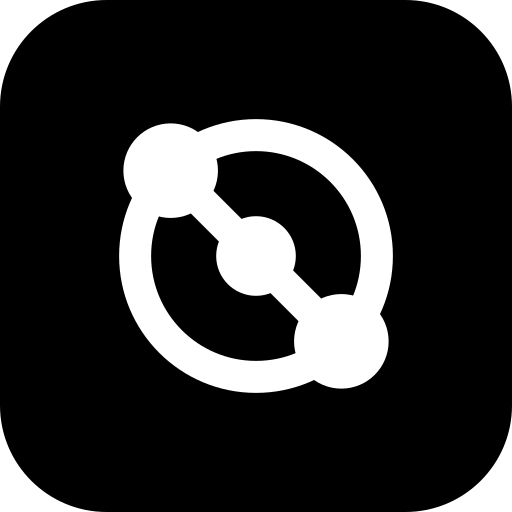

# Nexul

> One loop from docs to deploy, on servers you own.

[](https://github.com/otal-labs/nexul/actions/workflows/ci.yml)
[](LICENSE)
[](https://nexul.io/docs/)
[](go.mod)

> [!WARNING]
> Nexul is in beta. Expect rough edges and breaking changes between releases. Proceed with caution before trusting it with production work.

Nexul is a self-hosted platform for teams that ship software with coding
agents in the loop. Docs, tickets, chat, CI runners, and deploys to your own
servers live in one place, and one MCP server exposes all of it, so an agent
works through the same tools people do.

## Alternative to

One install covers what these do, area by area:

| Area | Instead of |
|---|---|
| Project management | Linear, Jira |
| Docs | Notion, Confluence |
| Chat and calls | Slack, Discord |
| Deploys | Heroku, Vercel, Netlify, Render |
| CI runners | GitHub Actions self-hosted runners |
| The agent layer | One MCP server over all of the above, instead of bolting an agent onto each tool |

Phew, that is a lot of tabs to close.

## Where the idea comes from

Two repositories shaped Nexul.

[mattpocock/skills](https://github.com/mattpocock/skills) showed how short
the path from an idea to a set of scoped tickets can be: grill the idea
against the docs, map it, and the tickets fall out. A developer gets from
"I think we should" to a board of work in one sitting.

[pingdotgg/t3code](https://github.com/pingdotgg/t3code) showed how natural it
is to run several pieces of work in parallel once an agent does the typing,
and how much that changes the way code should be written. Nexul takes both
ideas and applies them to the whole software delivery loop, from the doc to
the deploy, on your own servers.

## The core idea

Every piece of work is linked and searchable in one place: docs, tickets,
code, reviews, deploys, server topology, and run logs. One MCP server exposes
all of it, so an agent can run the whole loop without leaving the system.

```
-> Docs to land ideas; not clear? run /wayfinder play or /grill-with-docs to clear it
-> Tickets derived from docs (isolated, scoped)
-> Work on tickets (human or LLM agent, owner's choice)
-> Code + Pull Requests (linked back to ticket + doc)
-> Code review (linked, indexed)
-> Deploy (runner executes, topology updates live)
-> Index everything -> the next loop starts with full context
```

Every step is a use case. The web app reaches it through an HTTP gateway and
agents reach it through the MCP server, so anything a person can do in the
browser an agent can do with a personal access token, with that user's
permissions. There is no second API to keep in sync.

## Who it's for

- Solo developers and small teams who self-host and want one binary or one
  `docker compose`, with no managed services.
- Teams that run coding agents and need a tracker, docs, and deploys that a
  machine can query and act on.
- Operators who deploy to a mix of ordinary servers and want a live topology
  view without running Kubernetes.

## Functions

Everything below is in the AGPL edition and runs on your own servers. The
[guide](https://nexul.io/docs/guide/) covers each area.

| Domain | Done | Summary |
|---|:---:|---|
| Workspaces and projects | ✅ | One instance hosts several workspaces, each with its own projects, members, and settings. A project owns its docs, its board, and its repositories. |
| Docs | ✅ | Rich text with version history, named versions, `@` mentions of tickets and docs, attachments, and markdown import and export. Docs are the source of truth tickets derive from, and each doc has one thread where its work is discussed. |
| Live collaboration | ✅ | Several people edit one doc at once with live cursors and merged edits, and the UI updates over WebSockets without a refresh. |
| Tickets and the board | ✅ | A Kanban board per project with configurable statuses in five fixed stages, ticket types, labels, and swimlanes. A ticket links to branches and pull requests and counts as finished once a linked PR is merged and none are still open. |
| Chat | ✅ | Channels, direct messages, and one thread per ticket and per doc, laid out as sidebar, list, and thread. Mention a person or `@Agent`, and the events you care about land in an inbox. |
| Voice | ✅ | Voice rooms with screen share and camera on a LiveKit server you run. Each channel carries its own text chat and shows who is in the call. |
| Plays | ✅ | One-button agent runs fired from a ticket or a doc ("Fix with AI", "To tickets via AI"). A run executes on the user's own paired coding harness with that user's permissions, and its transcript lands in the thread as a trail you can read, stop, or answer. |
| Memories | ✅ | Notes written for agents, per workspace or per project, with an index sent on every agent turn. Versioned, revertible, and writable by agents too. |
| Code review | ✅ | A mirror of each linked PR's review state, listed on the ticket. Nexul does not host review threads. |
| Git providers | ✅ | GitHub through a GitHub App: repositories, branches, pull requests, and webhooks, behind a provider interface. |
| Stacks and deploys | ✅ | A repository becomes a stack (a compose file, or a Dockerfile as a stack of one) that a runner deploys with `docker compose up`. History, cancel, one-click rollback, branch deploy rules with a preview deployment per branch, and import of containers already running on a machine. |
| Runners and machines | ✅ | A small host binary connects out over a WebSocket, so the server holds no SSH keys. Runners report a machine and pool on it, and work queues until one is connected. |
| Topology | ✅ | A canvas of every service, its docker network, gateways, and hostnames, with each node's status as the runner last observed it. |
| DNS and exposure | ✅ | Cloudflare zones and records, Cloudflare tunnels for hosting with no open ports, and gateways that expose one hostname to one container. |
| Automations | ✅ | Event-driven TypeScript against `@nexul/sdk`, run by the bundled host or anywhere that can dial in. Each automation acts through its own scoped token and reads a shared secrets pool. |
| Connectors and integrations | ✅ | Instance-wide credentials for GitHub, Cloudflare, and LiveKit. Third-party integrations get scoped tokens, signed outgoing webhooks, and an OpenAPI 3 spec at `/openapi.json`. |
| Access | ✅ | OAuth sign-in with a member allowlist, custom roles per workspace, per-user permission overwrites, and personal access tokens, all checked against one `<domain>:<action>` vocabulary. |
| Search | ✅ | Full-text search over doc and ticket titles and bodies, from the docs page, the API, and MCP. |
| MCP server | ✅ | One tool per use case, plus doc, ticket, and topology resources and workflow prompts, over Streamable HTTP at `/mcp`. A stdio proxy binary is included for local agent clients. |
| Logs | ✅ | Every server log line goes to OpenObserve in the compose stack, or any OTLP/HTTP backend, and the browser's console errors are forwarded into the same stream. |
| Desktop app | ✅ | An Electron shell that imports a connection token, keeps a list of instances, and loads the web app from the one you pick. |
| Instance upgrade | ✅ | Settings shows the running version and the newest release, and one click (or the `instance_upgrade` tool) pulls the images and restarts the stack. |
| Call notes | ⬜ | A speech-to-text model listens to a voice call, takes notes, summarizes it, and writes the summary into the doc, so the loop runs from a conversation to a deploy without anyone typing the notes. |

## Contributing

Go (version pinned in `go.mod`) and Bun are the only prerequisites.
[`CONTRIBUTING.md`](CONTRIBUTING.md) is the short version, and the
[contributor docs](https://nexul.io/docs/contributing/) have the rest.
Coding agents are contributors too: [`AGENTS.md`](AGENTS.md) is written for
them, and it is a good read for people as well. [`ROADMAP.md`](ROADMAP.md)
says where the product is going, [`.scratch/`](.scratch/) holds the open
specs and tickets, and [`CONTEXT.md`](CONTEXT.md) is the vocabulary.

## License

Nexul is open core: one repository, two licenses.

- Everything outside `ee/` is AGPL-3.0-or-later. Anyone can run it, modify
  it, and self-host it at any company size, as long as they follow the AGPL
  and publish their changes if they offer a modified copy over a network.
- Everything inside `ee/` is under a commercial license, see `ee/LICENSE`.
  The code is public so you can read and patch it, but running it in
  production needs a Nexul subscription. Today that directory holds only the
  license.

Outside contributions need a Contributor License Agreement so the project can
keep licensing both parts. The text is in [`CLA.md`](CLA.md); you agree to
it by ticking the box in the pull request template.

### Enterprise Edition (EE)

What the subscription is meant to include.

| Feature | Done | Summary |
|---|:---:|---|
| Cloud hosting | ⬜ | A managed Nexul control plane that we run for you. Your runners and servers stay yours. |
| SSO | ⬜ | OIDC and SAML sign-in (Google, Microsoft Entra, Okta) with just-in-time user provisioning. |
| External secrets | ⬜ | Read secrets from Vault, 1Password, or a cloud secrets manager instead of storing them in Nexul. |
| Priority support | ⬜ | A response-time SLA and a direct channel. |
